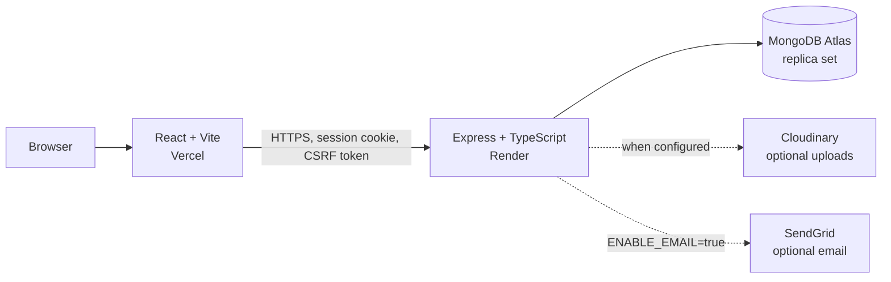

# TicketNest

TicketNest is a full-stack event-booking portfolio project focused on the part
that is genuinely difficult: keeping seat inventory correct when multiple
people try to book at the same time.

Visitors can browse events without an account. Authentication begins when a
visitor opens the seat map, because selecting seats creates a real ten-minute
inventory hold. The attendee journey then continues through a clearly labelled
simulated checkout and into My Bookings.

**[Open the live demo](https://ticketnest-iota.vercel.app)** · browsing does not
require an account

> Payments are simulated. TicketNest has no payment provider, sends no card
> details to the backend, and never moves money.

---

## Try it in 60 seconds

1. Open the live demo and choose a published event.
2. Click **Book Now**. TicketNest asks you to sign in before opening the seat
   map because that is where inventory-changing actions begin.
3. Sign in with the attendee account below.
4. Select seats and watch the running total update from each seat's configured
   tier and price.
5. Continue to checkout, observe the hold countdown, and complete the simulated
   payment.
6. Confirm that the paid booking appears in **My Bookings**.

To demonstrate contention, use two different attendee accounts in separate
browsers. You can use the seeded attendee in one and register a temporary
attendee in the other. Select the same seat in both and continue at nearly the
same time: one booking succeeds and the other receives a conflict.

### Demo accounts

All seeded demo accounts use **`DemoPassword123!`**.

| Role | Email | Hosted demo access |
| --- | --- | --- |
| Attendee | `attendee@demo.ticketnest` | Browse, hold seats, run simulated checkout, and view bookings |
| Organizer | `organizer@demo.ticketnest` | Inspect the dashboard, events, prices, and seat maps; sensitive writes are blocked |
| Admin | `admin@demo.ticketnest` | Inspect masked users, metrics, bookings, requests, and venues; sensitive writes are blocked |

The hosted site uses `DEMO_MODE=true`. All organizer accounts and the public
demo admin are blocked from sensitive management writes by both the UI and the
API. A private system admin created from deployment environment variables is
not published here and remains trusted. Local clones default to
`DEMO_MODE=false`, which exposes the complete organizer and admin workflows.

The public database is disposable and may be reset. Do not enter personal
information. Identifiers shown to the public demo admin are masked.

### Demo walkthrough

[](media/ticketnest-demo.mp4)

**[Watch the 49-second demo video](media/ticketnest-demo.mp4)** — browse an
event, select premium seats, complete the simulated checkout, and confirm the
paid booking in My Bookings.

---

## What it demonstrates

### Attendee workflow

- Public event discovery and event details
- Email-optional registration and session-based authentication
- Keyboard-accessible seat selection with tiers, prices, and a running total
- Atomic ten-minute seat holds and explicit conflict handling
- Simulated payment success/failure and booking history
- Favorites plus unpaid, paid, expired, failed, and refunded booking states

### Organizer workflow

- Registration and admin approval
- Dashboard statistics that distinguish active, archived, and cancelled events
- Draft event creation with template or custom venues
- Grid generation, blocked seats, and per-seat tier/price overrides
- Seat-map preview and immutable published inventory structure
- Atomic event cancellation with booking and hold cleanup

### Admin workflow

- Organizer approval decisions
- Venue-template and seat-map management
- User suspension and immediate session invalidation
- Booking, user, venue, request, and operational dashboard views
- Forced initial-password rotation for privately seeded admins

---

## Architecture



| Area | Technology |
| --- | --- |
| Backend | Node.js 22, TypeScript, Express 5, Mongoose 8 |
| Data | MongoDB replica set, transactions, explicit migrations |
| Authentication | Passport local strategy, bcrypt, server-side MongoDB sessions |
| Frontend | React 19, React Router 7, Vite 7, Tailwind CSS 4 |
| Tests | Vitest, Supertest, Testing Library, Playwright, `mongodb-memory-server` |
| Optional services | SendGrid for email, Cloudinary for uploads |
| Hosting | Vercel frontend, Render API, MongoDB Atlas |

Requests follow `routes → middleware → controllers → services → models`.
Authorization, ownership, event lifecycle, and inventory rules live in the
service layer so they cannot be bypassed by calling a different route.

---

## How the seat hold stays correct

A seat map is one document per event with an embedded `seats` array. Each seat
is `available`, `reserved` with an owner and expiry, or `sold`.

Claiming a seat is a conditional update rather than a read followed by a write:

```js
findOneAndUpdate(
  {
    eventId,
    seats: {
      $elemMatch: {
        x,
        y,
        $or: [
          { status: "available" },
          { status: "reserved", reservedUntil: { $lt: now } },
        ],
      },
    },
  },
  {
    $set: {
      "seats.$.status": "reserved",
      "seats.$.reservedBy": userId,
      "seats.$.reservedUntil": expiresAt,
    },
  }
)
```

Three details matter:

- `$elemMatch` makes all conditions apply to the same embedded seat. Separate
  dotted-path conditions can accidentally match different array elements.
- One transaction covers the complete seat selection and booking. If the third
  of three seats is unavailable, the first two claims roll back as well.
- Lifecycle-changing operations update the event document inside their
  transactions. MongoDB write conflicts force a racing booking or cancellation
  to re-evaluate the current state.

Expired-hold release, unpaid-booking cancellation, mock payment, and event
cancellation all use conditional writes. Repeating a cleanup cannot release a
seat that has since been sold or claimed by somebody else.

Published seat-map structure is locked. Organizers can inspect it, but cannot
regenerate the grid and overwrite held or sold inventory after publication.

---

## API conventions

List endpoints return page envelopes:

```json
{
  "data": [],
  "total": 42,
  "page": 1,
  "limit": 20,
  "pageCount": 3
}
```

`page` and `limit` are validated, `limit` is capped at 100, and stable sorting
uses `_id` as a tiebreaker. The public Events page exposes Previous/Next
controls rather than silently rendering only the first response page.

Errors use a stable shape:

```json
{
  "message": "These seats are no longer available: (1,3)",
  "error": "These seats are no longer available: (1,3)",
  "code": "OPTIONAL_STABLE_CODE"
}
```

Clients can branch on codes such as `CSRF_INVALID`, `HOLD_EXPIRED`,
`SEAT_MAP_LOCKED`, `DEMO_RESTRICTED`, and `RATE_LIMITED` without matching prose.

---

## Run locally

### Requirements

- Node.js 22 or newer
- npm 10 or newer
- MongoDB running as a replica set

MongoDB transactions do not work on a standalone `mongod`. Atlas is already a
replica set. For a local single-node development replica set:

```bash
mongod --replSet rs0 --dbpath /your/data/path
```

Then run `rs.initiate()` once in `mongosh`.

### Install

```bash
git clone https://github.com/Omer-Mevlutoglu/ticketnest.git
cd ticketnest

cd backend
npm ci
cp .env.example .env

cd ../frontend
npm ci
cp .env.example .env
```

PowerShell equivalents for the two copy commands are:

```powershell
Copy-Item .env.example .env
```

Every backend variable is explained in `backend/.env.example`. Real `.env`
files are ignored; never commit them.

### Core configuration

| Variable | Purpose |
| --- | --- |
| `MONGO_URI` | Replica-set database connection |
| `SESSION_SECRET` | Session and CSRF secret; use a long random value |
| `FRONTEND_URL` | Exact browser origin used for links and origin checks |
| `CORS_ORIGINS` | Comma-separated credentialed browser origins |
| `EMAIL_VERIFY_TOKEN_SECRET` | Email-verification token signing secret |
| `PASSWORD_RESET_TOKEN_SECRET` | Password-reset token signing secret |
| `ENABLE_MOCK_PAYMENTS` | Enables the simulated payment endpoints |
| `DEMO_MODE` | Protects hosted public management workflows |

Cloudinary variables are needed only for upload workflows. `ADMIN_EMAILS` and
`ADMIN_INITIAL_PASSWORD` privately bootstrap real system admins; remove them
from the deployment environment after those accounts exist and their passwords
have been changed.

### Email modes

| `ENABLE_EMAIL` | Registration and reset behavior | Required provider values |
| --- | --- | --- |
| `false` | No message is sent. Accounts are made login-eligible immediately, so email ownership is **not verified**. Password reset is hidden. | None |
| `true` | New accounts must follow a verification link before login. Password-reset email is enabled. | `SENDGRID_API_KEY` and a SendGrid-verified `FROM_EMAIL` |

The public portfolio intentionally uses `ENABLE_EMAIL=false`. A clone can set it
to `true` to exercise the complete SendGrid verification and reset workflow.

### Migrate and seed

```bash
cd backend
npm run migrate
npm run migrate:check
npm run seed:demo
```

The normal seed upserts the three demo accounts, two venues, and three events,
then clears demo bookings. It does not wipe unrelated application data.

The following form is destructive and intended only for a disposable portfolio
database. The confirmation must exactly match the connected database name:

```bash
npm run build
node dist/scripts/seedDemo.js --fresh --confirm ticketnest
```

It preserves migration records and private system-admin accounts. Do not
manually drop collections as a substitute. The direct Node command is
intentional: some npm versions consume unknown `--fresh` and `--confirm`
arguments before they reach the seed script.

### Start

In one terminal:

```bash
cd backend
npm run dev
```

In another:

```bash
cd frontend
npm run dev
```

Open the application at `http://localhost:5173`. During local development,
Vite proxies same-origin `/api` requests to the backend on port 5000 so session
and CSRF cookies behave consistently. A deployed frontend instead uses the
`VITE_API_BASE` value supplied at build time.

---

## Verification

Backend checks:

```bash
cd backend
npm run typecheck
npm run build
npm test
npm run rehearse:release
```

Frontend checks:

```bash
cd frontend
npm run lint
npm test
npm run build
npx playwright install chromium
npm run e2e
```

Current local release gate:

- 284 backend tests across 27 files
- 9 focused frontend tests across 5 files
- 4 Playwright portfolio journeys
- Zero frontend lint warnings
- Backend and frontend production builds passing
- Release migration/reset/seed rehearsal passing

Backend tests, release rehearsal, and browser tests create disposable
`mongodb-memory-server` replica sets. The test setup deletes normal database
environment variables and supplies placeholder provider values, so tests do not
connect to Atlas, SendGrid, or Cloudinary. The browser runner starts isolated
API/frontend services on ports 5100/4173 and shuts down their process trees.

GitHub Actions runs five jobs before merge:

1. **Backend** — typecheck, build, and integration tests
2. **Frontend** — lint, build, and unit tests
3. **Browser smoke** — isolated Chromium portfolio journeys
4. **Dependency audit** — high-severity npm audit gate
5. **Secret scan** — full-history Gitleaks scan

---

## Repository layout

```text
.github/workflows/
  ci.yml                    five release checks

backend/
  src/
    configs/                validated environment and database setup
    controllers/            HTTP request/response adapters
    jobs/                   expired-hold worker
    middleware/             auth, roles, CSRF, rate limits, errors
    migrations/             explicit, recorded data migrations
    models/                 Mongoose schemas and indexes
    routes/                 API routes
    scripts/                migrations, seeding, rehearsal, E2E server
    services/               business and lifecycle rules
  tests/                    integration tests on an in-memory replica set

frontend/
  e2e/                      Playwright portfolio journeys
  scripts/                  cross-platform isolated E2E runner
  src/
    components/             shared and role-specific UI
    context/                authentication state
    hooks/                  data loading and mutations
    lib/                    API/CSRF transport and pure helpers
    pages/                  public, auth, attendee, organizer, admin routes
    test/                   frontend test setup
```

---

## Operations

- `GET /healthz` is liveness. It answers without querying MongoDB.
- `GET /readyz` is readiness. It fails when MongoDB is unreachable, migrations
  are pending, or shutdown has started. Render should use this endpoint.
- Every response has an `x-request-id`, which is included in structured request
  and error logs.
- On `SIGTERM`, the API becomes unready, stops the expiry worker, drains
  requests, closes MongoDB, and enforces a shutdown deadline.
- Migrations never run implicitly during API boot. Run `npm run migrate`, then
  require `npm run migrate:check` before deployment.

---

## Security controls

- `httpOnly` server-side sessions stored in MongoDB
- `Secure` plus `SameSite=None` cookies in production
- Origin validation and double-submit CSRF tokens on writes
- Per-endpoint authentication, registration, and password-reset rate limits
- Role, ownership, approval, demo-policy, and lifecycle authorization
- Immediate session invalidation after suspension or password reset
- One-time password-reset links and forced initial-admin password rotation
- Helmet headers and explicit credentialed CORS allowlist
- Generic production 500 responses without stack traces or driver details
- Masked public-demo admin data and API-enforced sensitive-write restrictions

---

## Troubleshooting

### Transactions require a replica set

If MongoDB reports that transactions are supported only on replica-set members,
start local MongoDB with `--replSet`, run `rs.initiate()`, or use Atlas.

### `/readyz` reports pending migrations

```bash
cd backend
npm run migrate
npm run migrate:check
```

Do not change the Render health path to `/healthz` to hide this condition.

### Login works locally but not across deployed origins

Use exact HTTPS origins with no paths:

- `FRONTEND_URL=https://your-frontend.example`
- `CORS_ORIGINS=https://your-frontend.example`
- `VITE_API_BASE=https://your-api.example`

Then rebuild the frontend because Vite values are embedded at build time.

### Email-enabled startup fails

When `ENABLE_EMAIL=true`, both `SENDGRID_API_KEY` and a verified `FROM_EMAIL`
are required. Set `ENABLE_EMAIL=false` if testing without SendGrid.

### Playwright cannot find Chromium

```bash
cd frontend
npx playwright install chromium
```

On Linux CI, use `npx playwright install --with-deps chromium`.

---

## Known limitations

- Payments are simulated: no provider, refunds, settlement, or real currency
  processing.
- Email ownership is not verified while `ENABLE_EMAIL=false`; this is an
  intentional zero-provider portfolio mode.
- The expiry worker runs inside one API process. Conditional writes make
  duplicate runs safe, but a larger system should use a queue or scheduler.
- One seat-map document contains every seat for an event. This is simple and
  transaction-friendly at portfolio scale, but large venues and extreme
  contention should use a separate seat collection.
- Money is stored as JavaScript numbers. Production billing should use integer
  minor units and an explicit currency.
- Cloudinary is the only upload backend and is optional rather than abstracted
  behind a storage interface.
- There is no event search or recommendation engine.

---

## License

ISC
